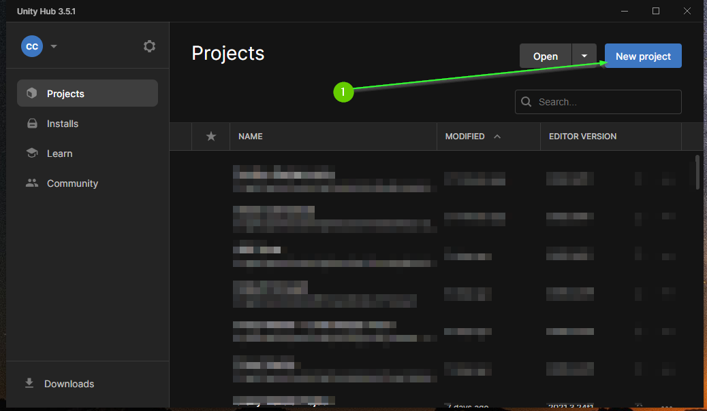
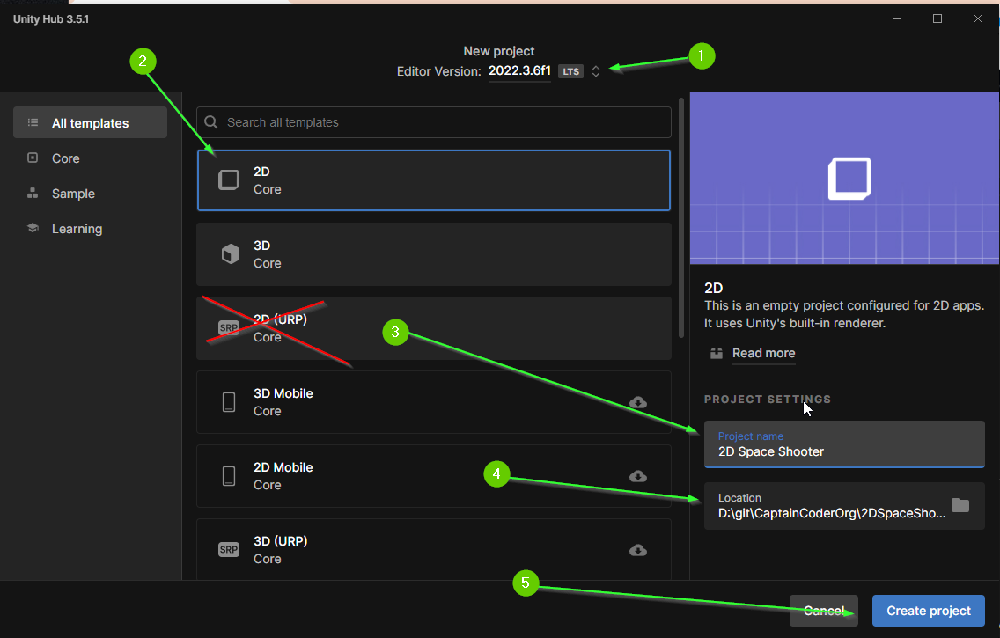
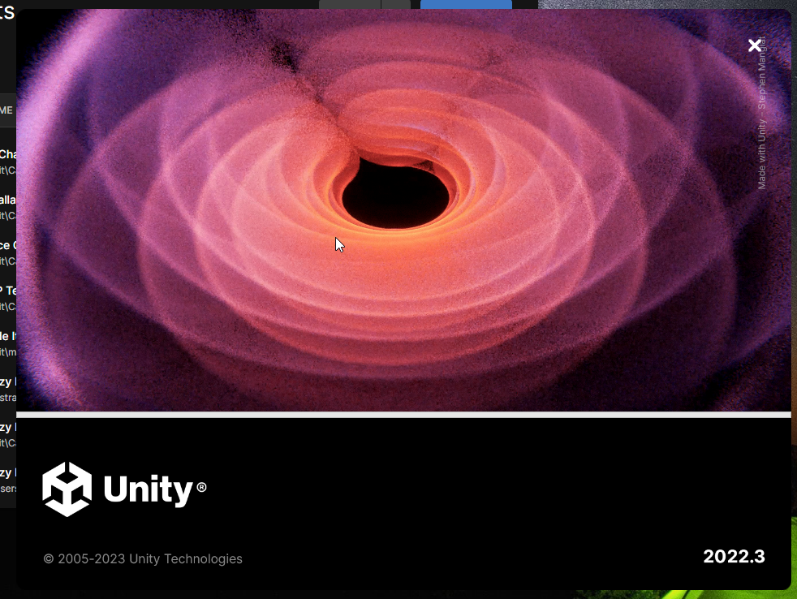
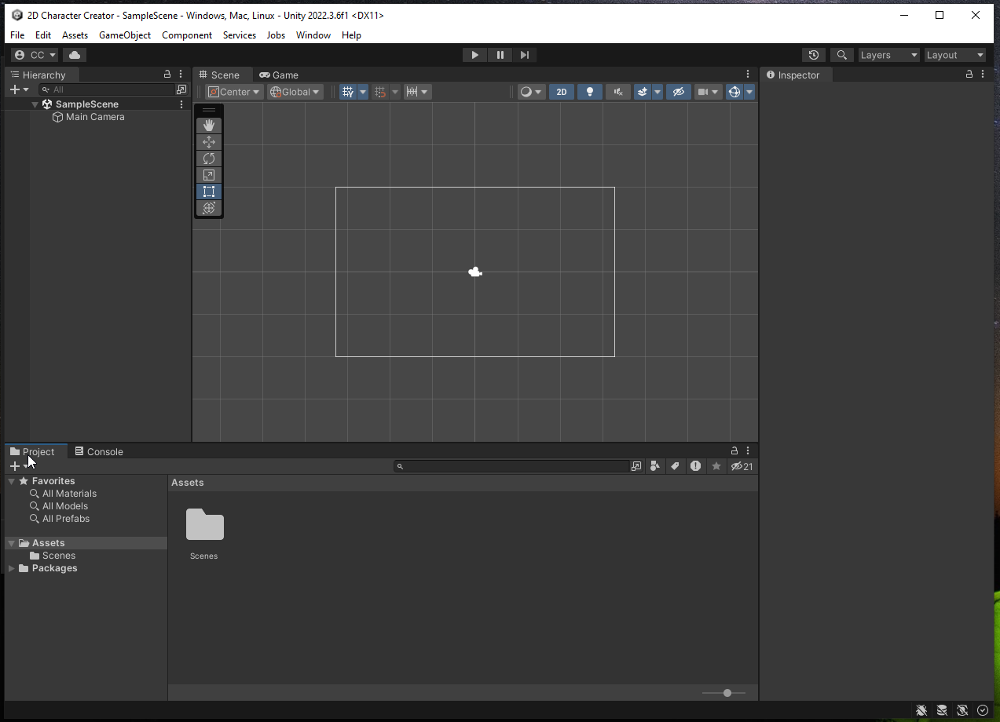

# Part 1: Creating a Project
{: .no_toc }

  

    Table of contents
  

  {: .text-delta }
1. TOC
{:toc}

## Unity Hub

Before you can start, you must create a Unity project. One of the easiest ways to do this is using Unity Hub.

1. In Unity Hub, select `New Project`

## Project Settings

On the next screen you will configure the options for the project.

1. Ensure you're using `Unity Editor 2022.3.xyz`. Although this guide may work for different versions, it is designed for 2022.
2. Select the 2D Core template. **Note: Do not select 2D URP**
3. Give your project a name
4. Select the destination where you would like the project to be on your computer
5. Click Create Project

If all went well, you will see the Unity Editor window as the project
initializes. This can take several minutes to finish as it is copying thousands
of files necessary for your project.

When the project has finished initializing, the Unity Editor should launch. It
*should* look similar (but maybe not identical) to the view below.

## What's Next?

Congratulations! If all went well, you have successfully created a 2D Unity project. In the next section, you will learn how to import assets into your project. When you're ready you should start [Part 2: Importing Assets]()

