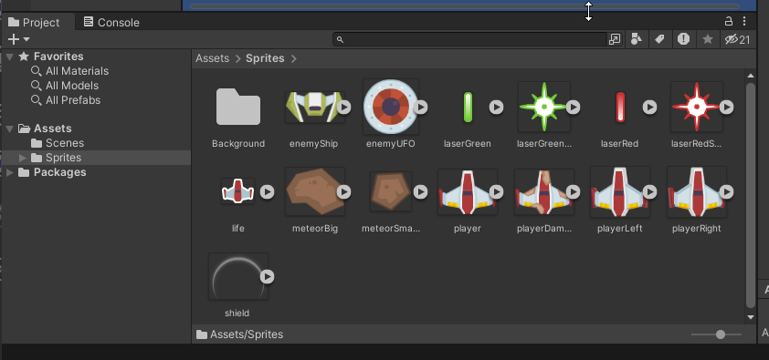

# Part 2: Importing Assets
{: .no_toc }

In this section, you will learn how to add external files to your Unity project
and create folders to keep them organized.

  

    Table of contents
  

  {: .text-delta }
1. TOC
{:toc}

 
## What is an Asset?

In Unity, an asset is any file or resource used to create and enhance your game
or interactive application. Assets can include 3D models, images, audio clips,
scripts, animations, and more. They are fundamental building blocks in Unity's
development process, and you can organize and manipulate them within the Unity
Editor to bring your game to life.

## Download the Assets

1. Download the project assets: [LINK](../files/Space-Shooter-Kenny-Assets-v0.zip)
2. Extract the assets
3. Verify the Contents:

   

### Credits

* Kenney Space ShooterGame Assets: [LINK](https://opengameart.org/content/space-shooter-art)

## Importing Sprites

### Create a Sprites Folder

In any non-trivial project, it is important to keep your files organized. Start by creating a folder for your Sprites.

1. Find the `Project`` window
2. Open the `Assets`` Folder
3. Right click in the `Assets`` Folder
4. Select `Create > Folder`
5. Name your folder `Sprites`

**Note:** You can rename a folder by right clicking and selecting `Rename`

<video autoplay loop muted style="max-width:700px">
  <source src="../imgs/02/01-create-sprites-folder.webm" type="video/webm">
</video>

### Importing Sprites

You can import files into a Unity project by dragging them into the project window. The file will be added to the location that is currently selected.

1. Open the `Sprites` folder
2. Drag the `enemyShip.png` asset into the project

<video autoplay loop muted style="max-width:700px">
  <source src="../imgs/02/02-import-sprites.webm" type="video/webm">
</video>

## Challenge: Import Remaining Assets

Now that you know the basics of creating folders and importing assets, can you finish importing the remaining files?

If all went well, your project window should look similar to the video below:

## What's Next?

